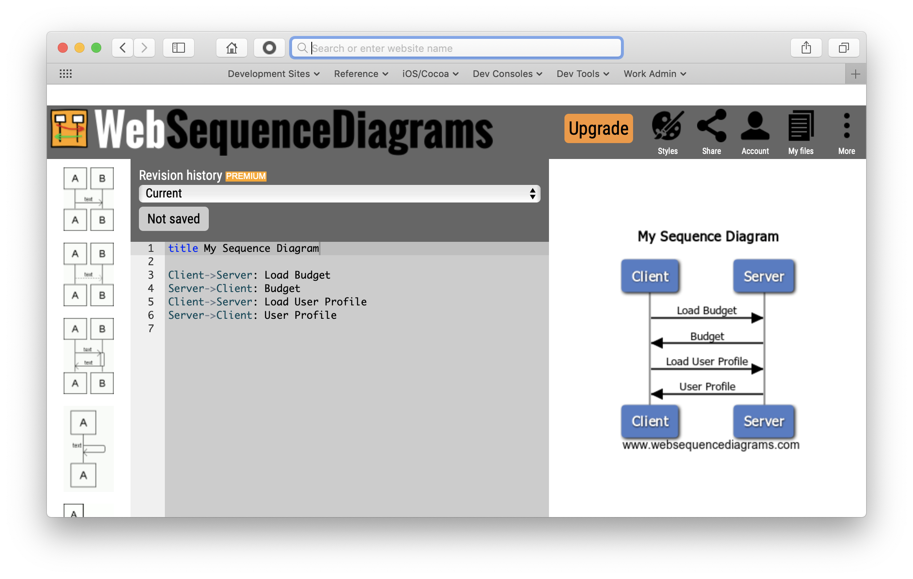

## Decomposition

---

🤔

---

Decompose: Break it up

---

# Shipping Large Units

* Lots of code
* Lots of testing
* Slow delivery to customers
* Discouragement and overwhelm

---

# Shipping Small Units

* A little bit of code
* A little bit of testing
* Deliver _something_ to customers
* Feedback and motivation

---

# When Decomposing Work

Find the smallest units of work that are:

* Shippable
* User-facing

---

By Henrik Kniberg

---

## Decompose the _Problem_ not the _Solution_

* Is this feature even needed?
* Is there a simpler alternative?
* What's the smallest, shippable, user-facing change we can make?

---

## Plan First

* _What?_
* _Why?_
* _How?_
* _Where?_

<small style="font-size: 18px;">
  <em>Who?</em>
  <em>When?</em>
</small>

---

## _What?_

* Design and architecture work done before touching a single line of code.

---

## _Why?_

* Stay focused
* Collaboration
* Accountability / Peer Review
* More accurately reflect your work

---

## Stay Focused

* Up front design work helps prevent you from getting sidetracked while coding.

---

## Collaboration

* A design helps immensely when someone else has to pick up work you didn't complete.

---

## Accountability / Peer Review

* A design review allows your team to help course-correct your work before you waste too much time on the wrong thing.

---

## More accurately reflect your work

* By dragging your ticket into `Architecture & Design` before `Develop`, Jira can more accurately capture what you're actually spending your time on.

---

## _How?_
* Text / Markdown
* Diagrams

Whatever helps express to your team, what you intend to do, and how you intend to do it.

---

# Sample Design Document
  

## Summary

* Blah blah blah.

## Vocabulary

* Blah - blah blah blah
* Blah - blah blah blah

## Design

* [Maybe a diagram / flowchart]
* Blah blah blah blah.

## Proposed Subtasks

* Blah blah blah
* Blah blah blah
* Blah blah blah

## Future Enhancements

* Blah - blah blah blah
* Blah - blah blah blah

---

## Tools for Diagramming

* LucidChart
* Web Sequence Diagrams
* MermaidJS
* ... and many more

---

---

## _Where?_
* Repository
* Github Wiki
* Github Issues

Someplace that facilitates team access and review.

---

Small Pull Requests:

<em>Why?</em>

---

Fast code reviews

---

More thorough reviews

---

---

Easier to course correct
- less emotional courage to request changes

---

Easier to understand

---

---

---

Fewer bugs

---

Pivot/Context Switch

---

No nested branches

---

Refactors are shareable more quickly

---

Fewer merge conflicts

---

Small Pull Requests:

<em>How?</em>

---

Hidden UI

---

New URL/Screen

---

Feature Flags

---

Add a new Method or Class

---

Don't separate tests and code

---

Include sample implementation code

---

Do one thing

---

Impact Analysis

---

Make sure QA is in the loop

---
